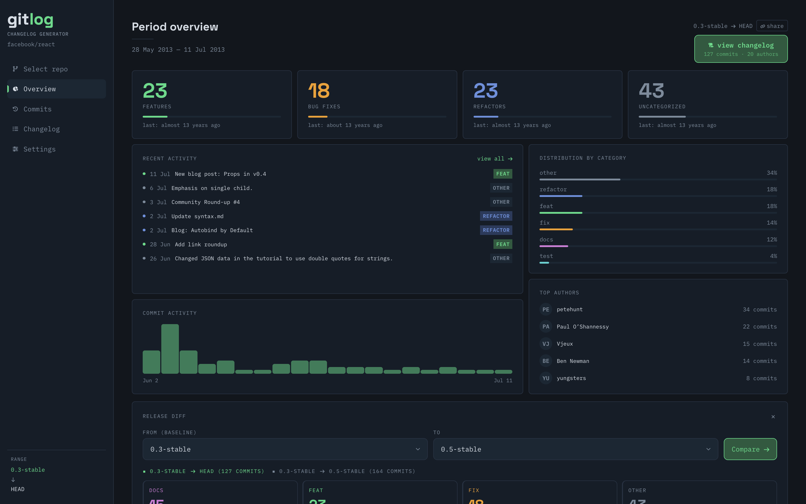
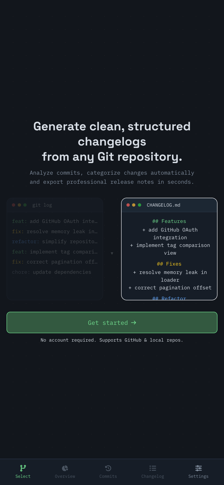
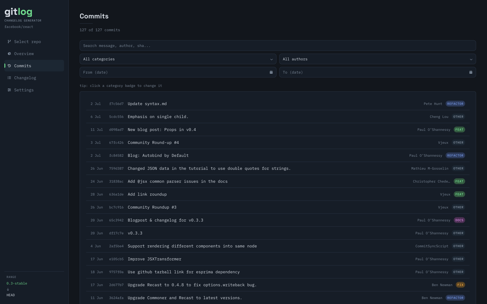

<div align="center">


# Gitlog

**📜 Changelog Generator**

Turn any Git repository's commit history into a structured, exportable changelog. <br/>
Paste a GitHub URL, pick a range, and get an instant overview — categorized commits, contributor activity, and a ready-to-ship changelog.

<br/>

[](https://gitlog.marianacastro.dev)
[](#-features)
[](#ℹ%EF%B8%8F-how-to-run-the-application)

</div>

<br/>

## 📜 Features

|                              |                                                                                                                                                                |
| ---------------------------- | -------------------------------------------------------------------------------------------------------------------------------------------------------------- |
| **🏷️ Commit Categorization** | Commits are classified into feat, fix, docs, refactor, style, and test through a two-pass engine — user keyword rules, then conventional-commit prefixes. |
| **📊 Instant Overview**      | Total counts by category, an interactive activity timeline, distribution bars, and top contributors — all from a single URL and range.                          |
| **🔀 Release Diff**          | Compare two commit ranges side by side with per-category deltas (`+4`, `-2`), percentage shares, and growth multipliers (`1.5× growth`).                        |
| **🔗 Shareable Permalink**   | The URL encodes the repo and range, so any analysis becomes a direct link that auto-loads on open.                                                              |
| **📦 Multi-format Export**   | Export the generated changelog as `.md` (paste into `CHANGELOG.md`), `.txt` (terminals & legacy systems), or `.json` (structured for CI/CD pipelines).          |

<br/>

## 🖼️ Screenshots

<table>
  <tr>
    <td align="center" width="62%"><strong>Desktop</strong></td>
    <td align="center" width="38%"><strong>Mobile</strong></td>
  </tr>
  <tr>
    <td valign="top"></td>
    <td rowspan="2" valign="top"></td>
  </tr>
  <tr>
    <td valign="top"></td>
  </tr>
</table>

<br/>

## 🛠️ Tech Stack

<p>
  
  
  
  
  
  
  
  
</p>

| Category          | Technologies                                |
| ----------------- | ------------------------------------------- |
| **Framework**     | Next.js 16 (Pages Router), React 19         |
| **Language**      | TypeScript 5                                |
| **Styling**       | Tailwind CSS v3                             |
| **Data Fetching** | Axios + SWR                                 |
| **UI Primitives** | Radix UI (Select, Popover)                  |
| **Icons**         | Font Awesome                                |
| **Dates**         | date-fns, react-day-picker                  |
| **Testing**       | Vitest                                      |
| **Tooling**       | ESLint, Prettier                            |
| **Deploy**        | Vercel                                      |

<br/>

## 📝 Project Description

Gitlog is a full-stack changelog generator that turns raw Git commit history into a structured, exportable overview. Most of the time, understanding what changed between two releases means digging through raw git logs and GitHub's PR list, manually piecing things together. Gitlog replaces that with a single flow: **paste a GitHub URL, pick a date or tag range, and get an instant structured changelog** — what used to take an hour now takes seconds.

It fetches commits from the GitHub API (or the local filesystem when running locally), classifies each one into a category, and renders a multi-view dashboard: an overview with an interactive activity chart, a commits table with a per-row category editor, a grouped changelog, and a per-contributor breakdown.

**Additional features:**

- **Commit categorization engine:** The flagship feature. See the [dedicated section](#-the-categorization-engine) below — a single pure function classifies every commit through user keyword rules, conventional-commit prefixes, and a broad vocabulary pass.
- **Debounced repository preview:** As you type a GitHub URL, a live preview card fetches repo metadata (stars, forks, description) with a 600ms debounce, so the API is only hit once you pause typing (`useRepoPreview.ts`).
- **Stateful multi-step flow:** The repository loading flow (URL → tags → commits) is managed by a custom hook (`useRepoLoader.ts`) that exposes a minimal patch-based state updater, keeping all async transitions in one place and making each step independently resettable.
- **Branch & tag comparison:** The range selector lists both branches and tags in grouped, searchable dropdowns, so you can compare `main` vs `develop` or `v1.0` vs `v2.0`. The API resolves each ref — trying `tags/` first, then `heads/` — so branch and tag names are handled transparently.
- **Release diff:** A "Compare with another range" panel fetches a second commit range and renders a side-by-side category breakdown: current count, delta, percentage share before and after, and a growth multiplier — reusing the already-loaded refs so no extra API call is needed (`ReleaseDiff.tsx`).
- **Changelog time grouping:** The generated changelog can be grouped by month or week within each category, and the grouping is reflected in every export format (`.md` gets `###` sub-headings, `.json` gets a `periods` array).
- **Shareable permalink:** After loading a remote repo, the URL is updated with `?repo=owner/repo&from=ref&to=ref`. Opening that URL auto-fetches the same commits and lands directly on the overview — a "share" button copies it to the clipboard.
- **Recent repositories:** Previously analyzed repos are persisted to `localStorage` and shown as one-click shortcuts, restoring both the tab (remote/local) and the URL or path.
- **Remote & local repos:** GitHub repos via URL (with an optional token for private repos or rate-limit bypass), and local repos by filesystem path when running locally.

<br/>

## 🏷️ The categorization engine

The heart of Gitlog isn't a regex grab-bag — it's a small, **deterministic** and **dependency-free** classifier that decides which category every commit belongs to. The whole pipeline runs server-side:

```
GitHub URL → resolve refs (tags/ → heads/) → fetch commit range (GitHub API)
    → categorize each commit (pure function, no deps)
    → group by category → optional time sub-grouping (month / week)
    → overview + table + changelog → UI / export (.md / .txt / .json)
```

**It classifies in two passes.** Each commit message runs through `categorize` ([`src/pages/api/commits/index.ts`](src/pages/api/commits/index.ts)) in order, so the most specific signal always wins:

- **User keyword rules** — category-specific keywords defined in settings are checked first, so a team's own vocabulary overrides everything else.
- **Conventional-commit prefixes** — `feat:`, `fix:`, `docs:`, `refactor:`, `style:`, `test:` are matched directly when present (`chore:` is recognized too and folds into refactor).
- **Broad vocabulary pass** — a final regex sweep against common words catches messages that don't follow the convention, falling back to a sensible default rather than dropping the commit.

**It stays editable.** Categorization is a suggestion, not a verdict — the commits table exposes a per-row category editor, so anything the engine gets wrong can be reassigned in one click, and the change flows through to the overview, changelog, and every export.

**It compares ranges, not just snapshots.** The release diff reuses the loaded refs to fetch a second range and renders a per-category delta — current count, `+/-` change, percentage share before and after, and a growth multiplier — turning "here's what's in this release" into "here's exactly how it changed since the last one".

<br/>

## 📌 What did I learn?

The most interesting part of this project was keeping the categorization **predictable** while still being forgiving. A naive single-pass regex either misclassifies non-conventional commits or forces every team into one vocabulary. Layering user rules → conventional prefixes → a broad fallback into one pure function meant the logic stayed easy to reason about and unit-test, while the per-row editor made the rare misses a non-issue. Building the multi-step async flow (URL → tags → commits) behind a single patch-based hook also taught me how much complexity a clean state boundary can absorb — every step stays independently resettable without scattering async logic across components.

<br/>

## ℹ️ How to run the application?

> Clone the repository:

```bash
git clone https://github.com/maricastroc/gitlog
```

> Install the dependencies:

```bash
npm install
```

> Start the service:

```bash
npm run dev
```

> Run all tests:

```bash
npm run test
```

> ⏩ Access [http://localhost:3000](http://localhost:3000) to view the web application.

> **No configuration needed.** A GitHub token is optional — it only raises the API rate limit and enables private repos.

> **Local repos are a self-host feature.** The "Local repo" tab analyzes repositories straight from your filesystem by path — no GitHub API, no rate limit, works offline. Because it reads the host machine's filesystem, it works **only when you run Gitlog yourself** (locally or self-hosted). The public deployment has no access to your machine, so it supports remote GitHub repositories only.

<br/>

<div align="center">

⭐ If you like this project, give it a star on GitHub!

</div>
